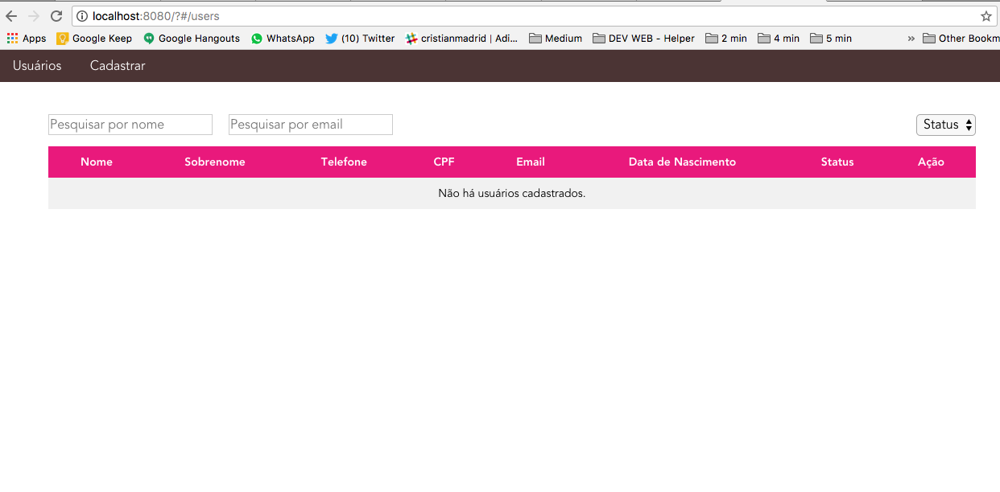

# CrudDoWhile
Teste para desenvolvedor web FulStack da empresa DoWhile

## Funcionalidades:

* Listagem de usuários.
* Pesquisa pelos campos: usuário, e-mail e status (ativo/inativo).
* Remover um usuário através da listagem, com tela de confirmação.
* Criar um usuário com obrigatoriedade de campos.
* Editar um usuário.

## Validações:

* Email único.
* Cpf único.

## Campos:

* Nome
* Sobrenome
* E-mail
* CPF
* Telefone
* Data Nascimento
* Status (Ativo/Inativo)

## Linguagem para o Back-end:

* [Node.js](https://nodejs.org/en/download/)

## Framework/Lib para o Front-end:

 * [Vue.Js](https://br.vuejs.org/v2/guide/installation.html)

## Banco de Dados:

 * [MySQL](https://dev.mysql.com/downloads/mysql/)

## Execução
### Servidor Node

1. Edite o arquivo database-service para incluir seus dados de conexão.
2. No terminal abra a pasta server dentro da raiz do projeto. E execute:
3. ``npm install`` para instalação das dependências.
3. ``node create-table.js``  para criação das tabelas e database.
4. ``node server.js`` para iniciar o servidor node.

### Vue.js
1. No terminal abra a pasta do projeto doWhile dentro da pasta FrontEnd. E execute:
2. ``npm install --global vue-cli`` Para instalar o vue-cli globalmente.
3. ``npm install`` Para instalação das dependências.
4. ``npm run dev`` Para executar.

 ### Se tudo der certo, ao acessar a url: http://localhost:8080/#/users você deverá ver a seguinte tela:
 
